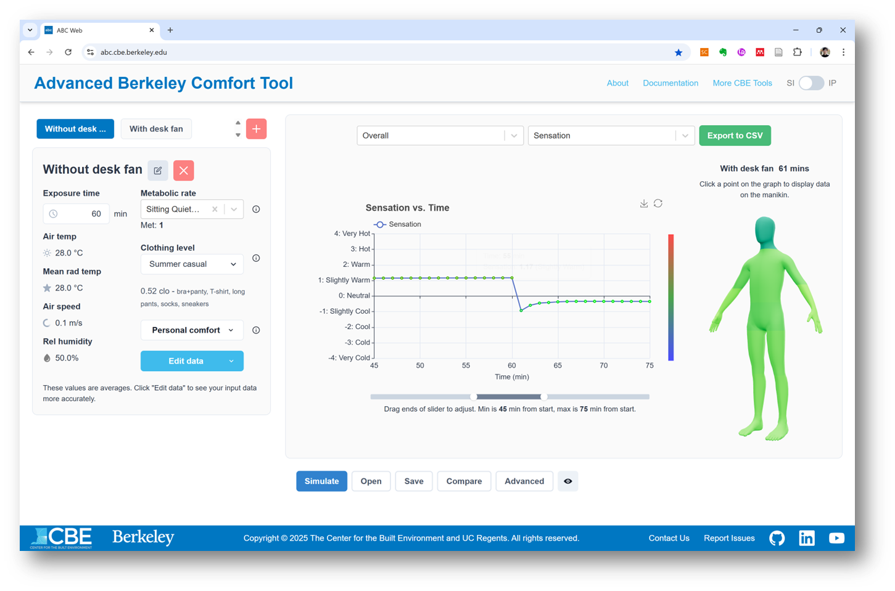

# Excel interface

## Overview

This Excel workbook has been designed to integrate the ABC model directly into Excel. One of its key advantages is that it allows users to easily input thermal environmental conditions (e.g., air temperature, relative humidity) for different body segments across multiple time steps. While the same functionality is available through the web interface, the Excel workbook offers a more user-friendly alternative.

We understand that some researchers want to evaluate thermal comfort and physiological responses using their own environmental measurement data, and we hope this workbook proves to be a valuable tool for that purpose.


Notes

This sheet is integrated with the ABC\_toolbox. Please download the toolbox from our GitHub repository (https://github.com/CenterForTheBuiltEnvironment/ABC\_toolbox) and specify the correct file path for the downloaded folder. **The model will not run if the file path for the toolbox is incorrect.**


## Sheet descriptions

### Simulation Information

You can define all information except thermal environmental data here.&#x20;


To run the model, **specify the file path for the downloaded ABC toolbox folder** on your computer (refer to the image below). Additionally, provide the required input fields highlighted in yellow.



The **"Simulate" button** on this sheet allows you to execute the model. In its current format, you can enter your data into the cells in column C. If left empty, the default values in column D will be used.


<figure><figcaption>
Simulation informatuion sheet: All the simulation inputs except thermal environmental parameters shoud be input here.
</figcaption></figure>

### Thermal Environment

This sheet is for defining thermal environment information.

\- Results: The output results of the ABC model will be written here.

\- Clothing Reference: This sheet contains past clothing insulation data. Use it as a reference for entering clothing insulation values in the SimInfo sheet.

\- Change Log: For version control.

